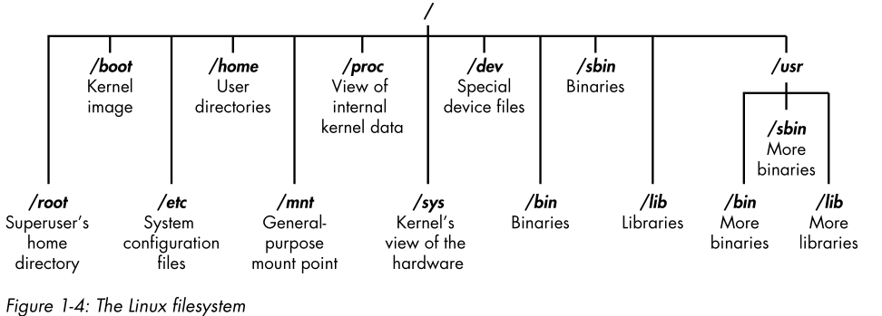
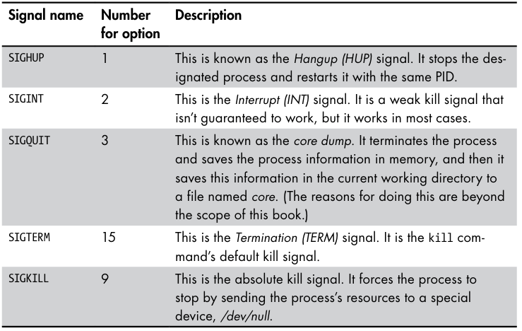
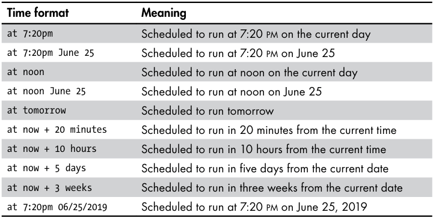
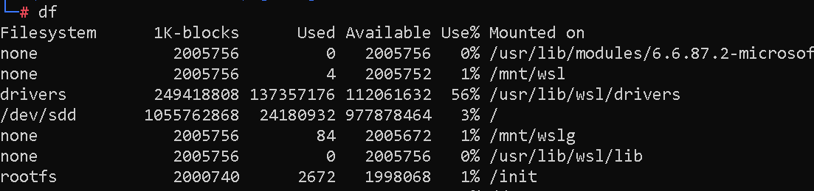

# LINUX ( LINUX FOR HACKERS )

## 

### INTRODUCTION:

INFILTRATE: means to secretly gain access to a system ,network or application usually with malicious intent and without being detected.

ESPIONAGE: act of secretly gathering information especially sensitive .

## why hackers use linux ?

- linux is open source
- linux is transparent
- offers granular control ( control for everything )
- most hacking tools are written for linux
- feature belongs to unix and linux

## The Basics :

- Binaries : files that can be executed ,similar to .exe files in windows .
- linux is case sensitive .
- Directory : same as folders in windows .
- Home : default directory of an user .
- Kali : is a distribution of linux specifically designed for penetration testers ,and distribution is DEBIAN .
- ROOT : linux administrator or superuser account designed for use by trusted person who can do nearly anything on the system .
- SCRIPT : a series of command run in a interpretive environment that converts each line to source code .
- SHELL : this is an environment and interpreter for running commands in linux : default shell is bash shell ( bourne again shell ) .
- Terminal : this is command line interface .

## FILESYSTEM :

no physical drive instead linux uses a logical filesystem .



summarized : 

- /root : the home directory of the powerfull user
- at the very top of the file is ‘/’ which is often referred to as a root of the file system .(this is different from root user )
- /etc : contains all system configuration files .
- /home : user home directory
- /mnt : where other filesystem are attached or mounted to the filesystem .
- /media : where cds and usb devices are usually attached or mounted to the filesystem .
- /bin : where application binaries reside .
- /lib : contain libraries (shared porgram that are similar to the windows DLLs )
- DLLs in windows: dynamic link libraries is a type of file that contains data , that multiple programs can use simultaneously .

## Basic Commands :

- pwd
- whoami
- cd  ( cd ..) ( cd ../../home/ashish)
- ls
- ls - l( list long )
- ls -la ( to show hidden files also )
- —help ( or -h )
- man toolname ( for manual )

## Finding Stuff :

- locate aircrack-ng ( go through entire filesystem and locate the occurence of word ( aircrack-ng)).[ recent files can’t be find bcz locate updation takes one day time ]
- whereis ( to locate binaries and manual location if available )
- which aircrack-ng ( return location of binaries in the PATH variable in linux .

### Powerful search

- FIND : find / -type f -name hero.txt 2>/dev/null ( ending part to silence the errors and get clean output )
- find / -type f —name hero.*  2>/dev/null( all extensions )
- approximate name search : find / -type f -iname “*her*txt” 2>/dev/null (find hero , HERO,Hero )
- find everything with its subdirectories : find ~/Documents -ls
- -type d ( for directory ) , -type f ( file) ,.
- find / -user root -type f 2>/dev/null .
- find / -uid 0 -type f 2>/dev/null .
- FIND / -USER ROOT -PERM -4000

## Filtering :

- grep ( global regular expression print )
- command | grep <required word>

## Cut command :

syntax : **cut OPTION... [FILE]…** 

options : 

- -f  :  Select by specifying a field, a set of fields, or a range of fields.
- -b :  Select by specifying a byte, a set of bytes, or a range of bytes.
- -c : Select by specifying a character, a set of characters, or a range of characters.

• `-d` (`--delimiter`) - Specify a delimiter that will be used instead of the default “TAB” delimiter.

- `N` the Nth field, byte or character, starting from 1.
- `N-` from the Nth field, byte, or character to the end of the line.
- `N-M` from the Nth to the Mth field, byte, or character.
- `M` from the first to the Mth field, byte, or character.

## How To Cut By Field :

To specify the fields that should be cut, invoke the command with the `-f` option. When not set, the default delimiter is “TAB”.
a **delimiter** is a [character](https://en.wikipedia.org/wiki/Character_(computing)) or a sequence of characters for specifying the boundary between separate, independent regions in [data](https://en.wikipedia.org/wiki/Data) such as a [text file](https://en.wikipedia.org/wiki/Text_file) or [data stream](https://en.wikipedia.org/wiki/Data_stream).

In the examples below, we will use the following file. The fields are separated by tabs.

test.txt

`245:789 4567    M:4540  Admin   01:10:1980
535:763 4987    M:3476  Sales   11:04:1978`

For example, to display the 1st and the 3rd field you would use:

```
cut test.txt -f 1,3
```

```
245:789	M:4540
535:763	M:3476
```

Or if you want to display from the 1st to the 4th field:

```
cut test.txt -f -4
```

```
245:789	4567	M:4540	Admin
535:763	4987	M:3476	Sales
```

## **How to cut based on a delimiter :**

To cut based on a delimiter, invoke the command with the `-d` option, followed by the delimiter you want to use.

You can use any single character as a delimiter. In the following example, we are using the space character as a delimiter and printing the 2nd field:

```
echo "Lorem ipsum dolor sit amet" | cut -d ' ' -f 2
```

```
ipsum
```

we can learn more about this on the website : [Cut Command in Linux | Linuxize](https://linuxize.com/post/linux-cut-command/#how-to-use-the-cut-command)

## SORT command :

The sort command in Linux is used to sort a file, arranging the records in a particular order.

like if a file has abcd… randomly in the vertical order if we use cat then th output will be random but if we use : sort filename : this will give the output with the sorted form like a b c d … 

### syntax : 
`sort [OPTION]... [FILE]...`

### options :

| **Options** | **Description** |
| --- | --- |
| **-o** | Specifies an output file for the sorted data. Functionally equivalent to redirecting output to a file. |
| **-r** | Sorts data in reverse order (descending).[`sort -r example.txt`] |
| **-n** | Sorts a file numerically (interprets data as numbers). [`sort -n file1.txt`] |
| **-nr** | Sorts a file with numeric data in reverse order. Combines -n and -r options. |
| **-k** | Sorts a table based on a specific column number.[`sort -k3 employee_data.txt`] |
| **-c** | Checks if the file is already sorted and reports any disorder. |
| **-u** | Sorts and removes duplicate lines, providing a unique sorted list. |
| **-M** | Sorts by month names. |

## Files and Directories :

- cat > filename ( to create an file and press ctrl+d to exit writing and cat ( concatenate) )
- above cmd for best for the small text files for larger one we can use text editors .
- touch filename ( just to create the file )
- mkdir <directory name>
- rmdir <directory name>
- cp oldfile new_path
- to rename a file : mv oldname newname
- rm filename
- complete deletion : rm -r filename

# TEXT MANIPULATION :

- cat filename
- head filename ( to view beginning of the file )
- head -20 filename or location ( to view first 20 lines of the file )
- tail -20 filename or location ( to read last 20 lines of the file )
- nl filename or location ( read file with number lines )
- sed s/mysql/MySql/g oldfile > newfile  (stream editor to replace a word s mean search and g mean to perform replacement globally then save to newfile ) (to replace all occurence of word mysql with MySql in the file to just do with the firs occurence fo the word dont use g in the end ).
- more filename ( for viewing large files press enter to go through the file )
- less filename ( similar but for scroll view)

 

# Analyzing And Managing Networks :

- ifconfig , ipconfig ( windows ) { interface , internet protocol }.
- iwconfig ( for wireless devices )
- changing the ip : ifconfig eth0 newip
- ifconfig eth0 newip netmask new brodcast new

### MAC spoofing :

- ifconfig eth0 down
- ifconfig eth0 hw ( hardware) ether new_address
- ifconfig eth0 up

### Assigning new ip address from the DHCP server :

- dhclient eth0

## Manipulating Domain NAME System :

- dig [hacker-arise.com](http://hacker-arise.com) ns ( name_server)
- dig [hacker-arise.com](http://hacker-arise.com) mx ( mail exchanger)

### Changing DNS server :

- nano /etc/resolv.conf
- add (server_name      address )
- or use echo”nameserver    8.8.8.8 “>/etc/resolv.conf
- nano /etc/hosts  ( mapping own ip address )

# SOFTWARES:

- apt list
- apt install
- apt remove <package-name> ( this will remove only the package not configuration files to do that use below )
- apt purge <package-name>
- apt update
- apt upgrade
- apt full-upgrade
- nano /etc/apt/sources.list ( to add new repositories instead of only kali repository )
- git clone “link” ( then cd  and install requirements )

# PERMISSIONS:

- r ( read) , w(write) ,x(execute)
- chown ( change_owner) bob filename ( to change the owner of )
- chgrp (change_group) security newids
- ls -l
- drwx-rwx-rwx ( first owner , group , users ) ( d = directory)

### Changing permission with UGO :

- user group others:
- chmod( change mode) [ chmod u,g,o-=+w,x,r <filename>]
- - ( remove ) , + ( add) , +( sets a permission )

### Changing permission with Decimal notation :

 


- chmod 777 or 755 filename or directory name
- linux automatically assign permission like 666 or 777 for directories .we can change the default permission values using the umask method .u mask is a three digit decimal numebr corresponding to three permissions digits ,umask number is substracted from the permissions number to give new permissions :
- 


- by default umask is configured to 022 ( check by just wirting in terminal (umask) ) .we can change the value by usign umask newvalue(007).

### SUID AND SGID ( switch user id and switch grp id )

- some files need root priveleges to execute but if we want to give a root permission to only that file so that any user can only use that file with root provileges and not other sensitive files we can set suid bit ( to set just use ) :
- just enter this :4+644=4644 instead of 644
- for sgid ( just enter 2+644=2644 instead of 644 )
- ifsgid is setted on a directory then the ownership of the files created in that directory will go to the direcotry creator not the file creator .

## 

## PROCESS MANAGEMENT

- ps command can be used to list the processes .
- `ps aux`: The `aux` option will show processes for all users (a), display the user that launched the process (u), and show processes that are not attached to a terminal (x). Looking at the ps aux command output, we can have a better understanding of the system and potential vulnerabilities.
- `ps -A`: View all running processes
- `ps axjf`: View process tree (see the tree formation until `ps axjf` is run below)
- 


- every process has PID ( important ) .
- USER = the user who invoked the process .
- PID = process id .
- %CPU AND %MEM storage usage and cpu usage .
- COMMAND = the command that started the process .
- we can combine PS AUX | GREP PROCESS_NAME .
- TOP command can be used to find the most greediest process and unlike the ps command it referesh the list every 10 seconds .(Q to quit and H or ? for interesting commands )
- NICE command can be used to prioritize an process its value varies from -20 to +19 and 0 be the default value .

-20————————0——————————+19-

   |                                 |                                            |

most likely            default nice                         least likely 

receive priority          value                                  receive priority 

- renice to alter the priority .
- nice and renice are little bit confusing because nice wants u to increment the value of nice value . and renice command wants an absolute value of niceness .
- if we want to give more resources to a process located at /bin/process we can speed it up by using : nice -n -10 /bin/slowprocess.
- to slow this process we will use : nice -n 10 /bin/process .
- to renice a slow process( to lower priority ) having PID 6996 we can use : renice 20 6996.
- can also use top utility to give nice and renice value : just press R and then give the PID to nice or renice .
- ZOMBIE PROCESSES  are processes which consume more resources .
- we can use *KILL signal ( optional ) PID  to kill a process .*
- signal values :



- to kill a process we use : kill -9 6996.
- to restart a process with same PID : kill -1 6996 .
- also in top press k and enter the pid .
- to run a process in the bg without new terminal add an & like : leafpad script &..
- to get this process in the foreground use : fg PID .

## SCHEDULING TASKS;

- THESE CAN BE USEFUL TO PERFORM REGULAR RECON AND BACKUPS .
- THERE ARE TWO MAJOR COMMANDS :
- AT = daemon(bg process ) for a particular one time schedule .
- CROND = for every week , days ,months scheduling .



- at 7:20 pm then and at> will come then we chave to write the cmd to execute at 7 pm .
- to check listed tasks use atq.

# MANAGING USER AND ENV. VAR.

TYPES OF VARIABLES:

1 . ENVIRONMENT VARIABLES =these variables are system-wide that control the way our system looks.

2 . SHELL VARIABLES = listed in lowercase and are only valid in shell ,.

- variables are simple key value pairs ( KEY =value )
- in case they have multiple value they will look like this ( KEY = value1:value2 )
- to view default( upper case ) env. variables use : env .
- to view all env . var including shell var. ( cmd : set more convenient ( set | more ))
- to filter out particular variable we can use grep ( set | grep HISTSIZE )
- HISTSIZE is an env. var. that has default value of 1000 ( to show only 1000 cmds in the history )
- to change the value of an env. we can use ( cmd : HISTSIZE=10000)
- above changes are only valid for a session terminal ( removed when terminal is removed )
- before making the changes permanent we should store the old value in a file ( like echo $HISTSIZE > ~/valueofHISTSIZE.txt
- to make changes permanent use ( export variablename).
- to check the value of an variable use (echo $variablename).
- to change the shell prompt ( like in windows C:\Users\ashis> in the cmd terminal ) to change this in kali we change the value of PS1variable PS1=”I AM HACKER “.
- to check where our systems path variables are stored use ( echo $PATH ) to add an directory so that we can use an tool in that every directory ( we also add our home directory to the env. variables like PATH=$PATH:NEWTOOLDIRECTORY .
- DONT DO THIS ( PATH =NEWDIRECTORY ) ( THIS WILL REMOVE ALL AND ADD ONLY NEW DIRECTORY IN THE PATHS ) .
- DON’T ADD TOO MUCH PATHS THIS WILL SLOW YOUR SYSTEM .
- TO  create an user defined variable to make an long cmd easy to use just make an new variable like (MYNEWVARIABLE = “HELLO” ) AND THEN EXPORT MYNEWVARIABLE .
- TO remove and variable use UNSET variablename.

## BASH SCRIPTING INDIVIDUAL AVAILABLE

# COMPRESSING AND ARCHIVING .

---

- tar (tape archive ) [used to create a single file from many one and called archive,tar file,tarball].
- mainly three options with tar ( c means create , v for verbose ,f means write to the files ).
- we can use (tar -cvf newtarfile.tar file1 file2 file3 ) .
- to view files without extracting an tar and with all details  ( tar -tvf newtarfile.tar ) .
- to view only files ( tar -xvf newtarfile.tar ) .
- to remove the output showing of used file use only ( -cf or -xf or —tf no v ) .
- this process instead of dec. size inc. the size of the combined file .

## COMPRESSION .

- gzip [ GNU zip ]( use extensions .tar.gz /.tgz  falls btw comprees and bzip2 ) .
- bzip2 ( extensions .tar.bz2 slowest but resultant file is smaller )
- compress ( extension .tar.z fastest but result size is more ) .

GZIP ( gzip hackerarise.* ) 

to unzip use ( gunzip hackerarise.* ) 

gzip can also work to extract zip files .

BZIP2 ( bzip2 hacker.* ) 

to unzip use ( bunzip2 hackerarise.* ) 

COMPRESS ( compress hackerarise.* ) 

to unzip use ( uncompress filename ) 

to unzip a file with the extension .zip use (unzip filename.zip)

# Creating Bit-By-Bit or Physical Copies of Storage Devices.

- dd (data duplicator ) command is used to make a bit by bit copy of a file , a filesystem , or even an entire disk ( even deleted files , yes deleted files can also be recoverable ., mostly used by the forensics investigators but it is very slow not ideal for day to day copying of the files .

command : dd if=inputfile of=outputfile 

more options can be used to make the process easy and more efficient .

**dd if=inputfile of=outputfile bs=4096 conv:noerror** 

`bs=4096`: Block size. Data will be read and written in chunks of 4096 bytes (4 KB). This can affect performance—larger block sizes often mean faster copying.

- `conv=noerror`: Conversion option. This tells `dd` to continue operation even if it encounters read errors. Without this, `dd` would stop on an error.

# Filesystem And Storage Device Management .

- linux has no representation like C ,D ,E . DISKS .
- LINUX HAS A DEVICE DIRECTORY CALLED /dev .
- navigate to the /dev and perform ( ls -l ) a list of all devices comesup and the sda , sda1,sda2,sda3,sda5 are hard drive and its partitions and usb flash drives .
- floppy drive  ( fdo) , hard drives ( hda ) , sata interface drives and small computer system interface (scsi) hard drives represented as ( sda ).
- device naming system like first hard drive ( sda ) , second ( sdb ) , third ( sdc ) and so on only last letter incrementing .
- sata drive partitions naming ( first partition sda1 , second partition sda2 and so on ) .
- fdisk -l ( to see all partitions ) .
- file types ( hpfs ( high performance file system ) , ( ntfs ( new technology file system ) , ( exfat  ( extended file allocation table ) .
- latest windows use NTFS filesystem and older one uses FAT , but linux use ext1 ,2,3 and ext4 being the latest one .
- on listing the files in /dev )( crw-------  1 root tty       4,  29 Sep 20 10:02 tty29 ) the first letter( here c ) represents the two ways that device transfer data in and out
- C ( stands for character and these devices are known as character devices , external devices that interacts with the system by sending and receiving data character by character like mice , key boards ,are character devices . )
- B ( stands for the : block devices , these are the devices which communicate in the blocks of data ( multiple bytes at a time ) and include devices like hard drives and dvd drives (sr0).
- lsblk ( list blocks ) lists all block devices ,also display multiple partitions in a kind of a tree like structure .

## mounting and unmounting

- a storage device must be first physically connected to the filesystem and then logically attached to the filesystem in order for the data to be made available to the operating system .
- point in the directory tree where devices are attached is known as the mount point .two main mount points in linux are /mnt and /media .internal drives are in /mnt and external like usb’s are in /media .
- to mounts a drive use : mount /dev/sdb1 /mnt  or mount /dev/sdc1 /media .
- the filesystem that are mounted on a system are kept in a file at /etc/fstab ( filesystem table ) ,which is read by system at every bootup .
- to umount a device ( other name eject )  [ umount /dev/sdb1 ] it is umount not unmount ( no n ).
- df ( disk free ) command will give the basic information on any hard disks or mounted devices .
- 



name          disk space      used      available   used    mounted on 

                   in 1k blocks      space

### 

overall recap :

sd SATA HARD DRIVE 

a FOR FIRST HARD DRIVE 

1  FIRST PARTITION ON THAT DRIVE 

flash drive is designated as sdb and external drive as sdc .

- fsck ( filesystem check ) ( also we have to specify the filesystem by deafult it is ext2 ) .
- we must unmount a drive before running a filesystem check .
- after unmounting check for any bad sectors ( fsck -p /dev/sbd1 )

# The Logging System

- logging is the process of storing the information about the events that occur when operating system and applications are run ,including any errors and security alerts .based on the series of rules .
- linux uses a daemon named ***syslogd to automatically log events on our system .there are several variations of this like : syslog , rsyslog ,syslog-ng are use on diff. distributions but rsyslog is used on debian .***
- we can find the rsyslog config. file in /etc this contains all rules for logging the events .
- there are too many logging rule but they follows a structure :
- facility.priority       action   { here facility keyword determines the which program to log , and priority keyword determines which kind of messages of that program to log and the action keyword determines where to log these events .
- like :   auth.authpriv.*        /var/log/auth.log
- example of facility keywords auth ( security / authorisation messages ) , cron ( clock daemons ) , mail ( mail system ) , lpr ( printing system ) , kern ( kernal messages ) .
- an asterisk denotes al;; facilities .
- priority keywords : error , info , debug , err ,alert , failed .
- generally log files are stored at /var/log .

### Automatically Cleaning Log files .

- log rotation ( process of archiving the log files and moving them to other location and then removing them after a certain period of time . )
- system do this by default .we can see that in /etc/logrotate.conf
- this file contain info like 1.weekly ( means log rotation will occur weekly )
- 2.rotate 4 ( rotate after every 4 weeks ) (we can change it to 24 6 months and 52 for a year )
- 3.we can choose to compress the log files .
- .

### Removing Evidence

- to remove the evidence we need to remove the log files .
- better way is to shred the log files  ( shred -h )
- main cmd : shred -f -n 10 path_to_file ( this will shred file 10 times )
- another way is to disable logging ,
- we can disable service : service servicename stop | restart | start
- we can use : service rsyslog stop .

# Using and Abusing Services

- service is an application that runs in the background waiting fo us to use it .
- examples : apache web server , openssh , mysql , postgresql .
- we can setup web server using apache physically spy with openssh and access the data with mysql , and store the hacking information with postgresql.
- cmd : service servicename start | stop | restart .
- for apache : service apache2 start
- for ssh : service ssh start
- for mysql : service mysql start .

## Apache :

it is the service used to host the own web server that can be further used to serve malware via a xss to anyone who visits our site .

after starting the apache service we can see its web page using [http://localhost](http://localhost)  and its index.html file is located at /var/www/html/index.html we can also edit this to any html code of our own .

## MYsql :

it is the mostly used database behind the database-driven web applications.

mysql is open source therefore used mostly .

some popular cms such as joomla , drupal , and ruby all use mysql .

1. service mysql start .
2. mysql -u root -p ( this will ask for password but by default pass is nothing just press enter )
3. sql is used to interact with the mysql databse this is an interpreted language , it has its own commands and syntax like : 

select - to retrieve data 

union - to combine the results of two or more select operations

insert - used to add new data 

update - used to modify existing data 

delete - used to delete data

1. example : select user ,password from customers where user =”admin”
2. commands in mysql are terminated with the semicolon .
3. cmd : show databases;
4. cmd: use databse_name;
5. accessing remote database : mysql -u root (username)-p <ip> .
6. cmd : show tables;
7. we can also see the structure of the table using describe statement ( describe card_numbers; ) 

## PostgreSQL :

it is the another open source relational database often used in very large , internet facing due to its ability to scale easily and handle heavy workloads .

cmd: service postgresql start .

also the metasploit uses the postgresql to store its modules , results and scans .

# Become anonymous and secure :

one of the mostly know network for secretly surfing the internet is : tor ( the onion router ) in 2002 founded   : 

## How Tor Works:

packets sent over the tor are not sent over the regular routers , ,but sent over the 7000 routers over the world ,this network encrypts the data and source + destination ip addresses and are decrypted by the next hop, when it is received in this way each packet contains the information about only the previous hop along the path and not the ip address of the origin , if someone intercepts the traffic they only see the ip address of the previous hop and the website owner can only see the ip address of the last router that sent the traffic , this ensure relative anonymity across the internet .

this network is relatively slow because of limited bandwidth of the network .

dark web can be accessed using the tor browser , and has .onion as their top level domain ( TLD) .

most of the security agencies found tor an illegal way to spy on other countries without being watched , they also trying to brake the anonymity of the tor browser , also NSA ( national scurity agency ) use traffic correlation to find a pattern in analyzing the traffic , but all this will not effect the anonymity of the tor . although there may be chances that our traffic could go through the nsa routers that they use to spy on others .

cmds : tor ( to run tor services ) 

cmd : torbrowser-launcher ( for browser to launch ) 

### another way : proxies

proxies can also be used to become secure and anonymous :


our ip is not exposed to the web server , but is stored in the porxy server logs , they can be accessed with a  warrant by the investigator .

proxy server use our ip and give its own ip to web server .

we can also use multiple proxies to become more anonymous this proxies combination is called PROXY CHAIN .

cmd : proxychains ( tool name also )  < the cmd u want proxied > < arguments>

for scanning a site using nmap anonymously we can use :

proxychains nmap -sT -Pn <ip> ( here ip is argument)

- something
    
    
    [`LINUX ( LINUX FOR HACKERS (1)](https://www.notion.so/LINUX-LINUX-FOR-HACKERS-1-277c8d1cc1d58071bf11ed234d708234?pvs=21)
    
- 

another last way is the vpns  and they have similar working like the proxies , dont use free ones to be secure and anonymous .

# MANAGING KERNEL AND MODULES ( LOADABLE) :

- ALL OS ARE MADEUP OF ATLEAST TWO COMPONENTS : KERNEL AND USER LAND .
- KERNEL : in the center of the os controls everything in os ,managing memory,controlling cpu,and even controlling what users see on screen .
- USER LAND : it includes nearly everything else .
- mostly users are not given kernel access instead given user land access so that they can access everything but cant control the os , therefore kernel permissions are given only to the root user or other privileged users .

### What is KERNEL module ?

kernel —→ nervous system of the os .

sometimes kernel has to be update to load the updated drivers like video card , music ,keyboard and other drivers .

but linux allow to add module by the admin to without going through the process of drivers to embedded to the kernel  or to add drivers we have to rebuild ,compile,and reboot the entire kernel . 

these modules are referred as loadable kernel modules or ( LKM).

by default lkm have access to the lowest level of kernel for necessity , these make them vulnerable , by malwares like rootkit that embed themself in the lkm to go to the os and disturb the os ,

### Checking the kernel version .

cmd : uname -a 


this command is telling us that our os is linux and its kernel build is 6.12.38 and the architecture its built for is the x86_64 and also tell us that it is using  SMP ( symmetric multiprocessing ) ( means this can also be run on cpu with multiple cores ) and was build on ( 2025-08012)

another method : cat /proc/version 

### Kernel Tuning with sysctl

tuning here mean we can change the memory allocation enable networking features and even harden the kernel against attacks .

cmd to tune : sysctl 

but this will only exits till the reboot to make them permanent we have to change the config file:

/etc/sysctl.conf  .

to see all options ins sysctl : 

sysctl -a | less 

to make your system work as router use :

sysctl -a | less | grep net.ipv4_forward 

change this line value to 1 by using the cmd :

sysctl -w inet.ipv4_forward=1

to make this change permanent use config file at /etc/sysctl.conf .

then uncomment the line net.ipv4_forward=1 

### Managing kernel modules .

to list the installed modules in the kernel use  cmd below from insmod ( install module ) suite :

cmd : lsmode 

now to install any module we can use insmod and to remove rmmod  but 

they can leave the kernel unusable or unstable bcz they dont install required dependencies therefore new linux systems has modprobe cmd  .

### More info about modules :

cmd : modinfo bluetooth (module name ) 

this also lists the dependencies required to properly working of the module .


this information from the cmd modinfo can be used to troubleshoot why any hardware is not working properly and see fro what version it is made for and what is the version we are using like that .

### Adding and removing module with modprobe  :

cmd : modprobe -a ( add) <modulename> 

cmd : modprobe -r ( remove ) <modulename>

why we are using modprobe instead of insmod ? 

because modprobe understands the dependencies , options ,intallation and removal procedures .

 

### Installing and removing a kernel module :

dont use the commands really just understand :

to add a new video card driver hackerarisenewvideo : 

cmd :  modprobe -a hackerarisenewvideocard 

now to test whether it is loaded properly we do : dmesg | grep video 

which prints out the message buffer from the kernel , and then filter for the video and look for any alerts that would indicate a problem .

to remove : cmd : modprobe -r hackerarisenewvideo

# Automating Tasks With Job Scheduling :

### scheduling an event or job to run on an automatic basis :

most useful tool for scheduling regular tasks : cron daemon ( crond ) and crontab ( cron table )

crond checks the crontable to check which cmd to run at which times :

to schedule tasks we can write them in a cron table file at /etc/crontab 

the cron table consists of seven fields : first five are for tasks scheduling and sixth one is to specifies the user and seventh for absolute path to the cmd we want to execute . 


for the day of the week 0 is for sunday and 7 is also for sunday . 


- m= minutes
- h=hours ( this field used 24 hrs format use 13 for 1pm  dopahar k 1 bje )
- dom = day of month ( can be stated as 15,16 want to run only on 15 and 16 date  or 15-17 to run on 15,16,17)
- mon = month
- dow = day of week ( we can also use 2,4 to run the script on tuesday and thursday )
- user =user
- command = command to run

we used asterisks because we want to run the script from monday to friday regardeless of the day of month or the month . 

we can edit crontab using : crontab -e ( edit ) 

then choose the option number and this will directly open the crontab another way to do this is nano /etc/crontab . 

### crontab shortcuts :

- @yearly
- @monthly
- @annually
- @weekly
- @daily
- @midnight
- @noon
- @reboot

instead of using 

m      h     dom      mon      dow      user        command 

00    12     *             *            *          root          /home/ashish/scanner.sh

we can use : 

@midnight               root   /home/ashish/scanner.sh

### using rc to run jobs at startup :

whenever we start our linux system many scripts run to set environment for us these scripts are known as rc scripts . 

after kernel has initialized and load all modules .it starts a daemon known as init or init.d , this daemon begins to run a number of scripts found in /etc/init.d/rc 

### linux runlevels :

linux has multiple runlevels that indicate what services should be started at bootup .

- 0 = halt the system ( halt mean stop )
- 1 = single-suer/minimal mode
- 2-5= multiuser modes
- 6 = reboot the system

### adding services to rc.d

we can use cmd below to run at startup a service or anything : 

update-rc.d <name of the script or service >  < remove | defaults|disable|enable>

for example if we want to run postgresql to store all our hacking results of metasploit in the postgresql databse we can use : 

update-rce.d postgresql defaults 

and after we reboot the system and check whether the postgresql is running we can see it running .: ps aux | grep postgresql 

with some long results of two or more lines not only one line .

### Adding services to our bootup via GUI:

to add services using the gui we can use tool ( reconf )  from kali repository .

run this by using : rcconf  

# EXTRA :

- adduser <name of the user>
- su( switch user) <name of the user>
- cat filename.txt | wc -l ( word count )
- netstat ( used to identify what open ports and services are there )
- apt( advance package tool ) install package_name
- apt autoremove ( to remove the packages that are automaticallyb installed but not needed now )
- 

| Double ampersand (`&&`) | Run the second command if the first was successful | `grep "secret" message.txt && echo "Secret found!"` |
| --- | --- | --- |
- uptime : this command can be use to find from how many hours our system is live .
- history commands are saved to a file ( cat .bash_history )
-